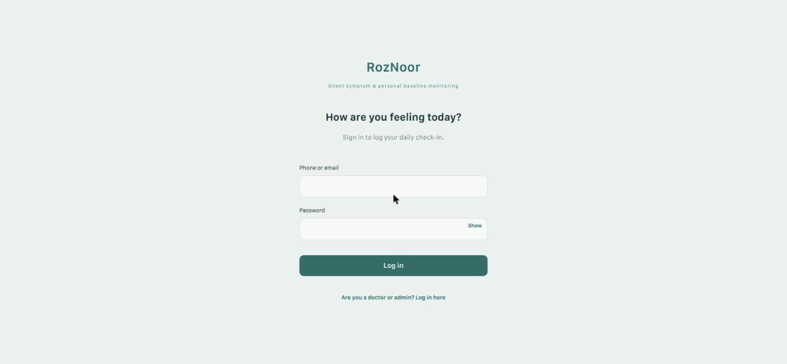
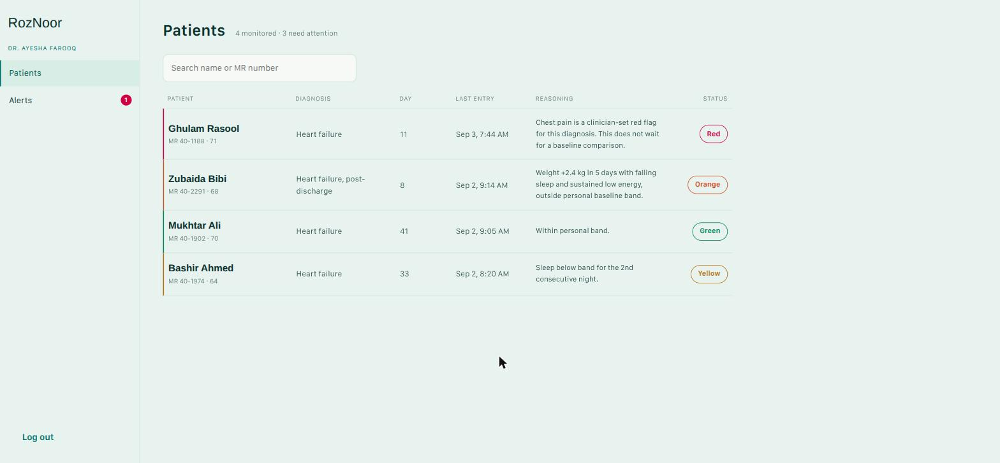
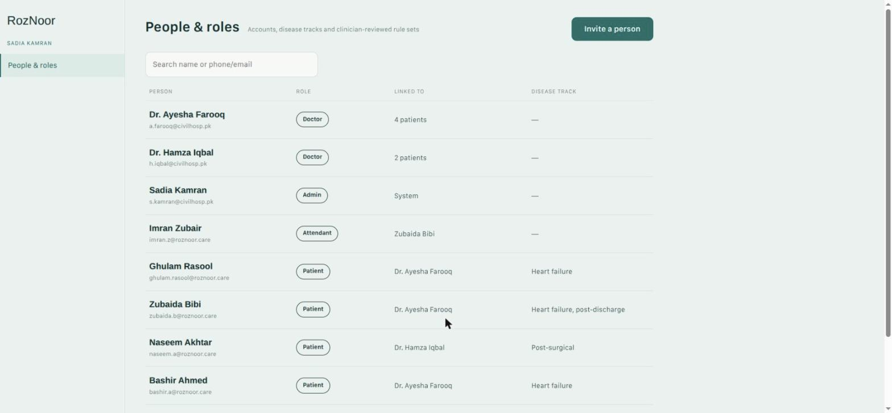
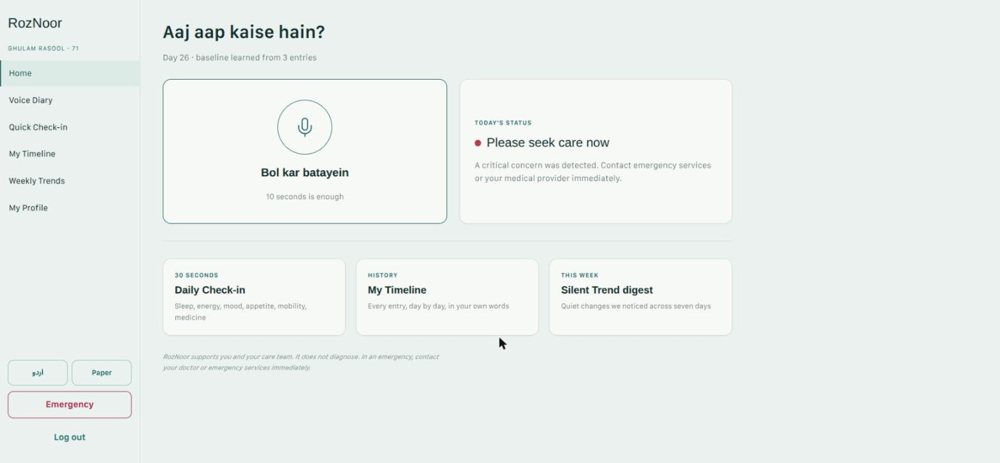
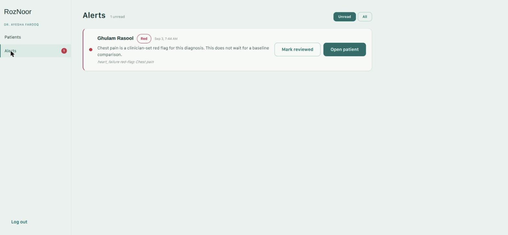
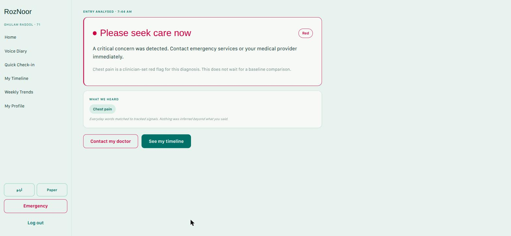
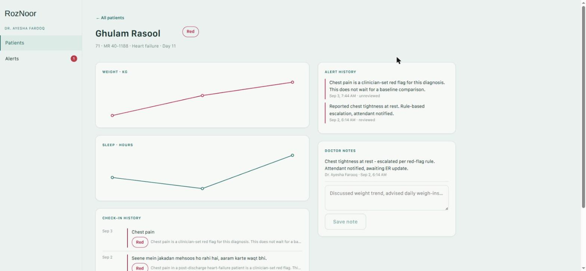
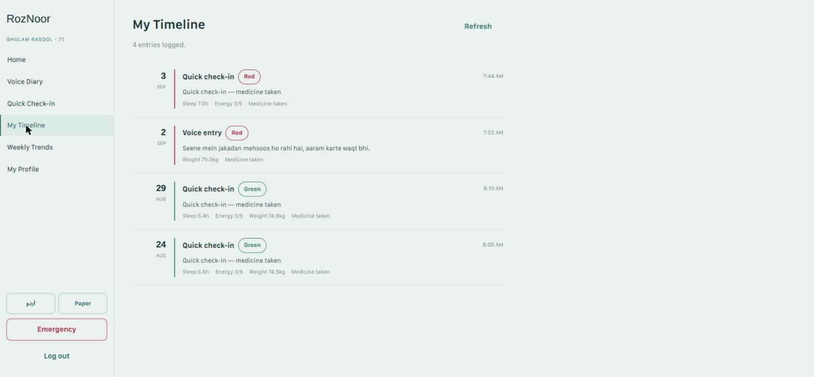
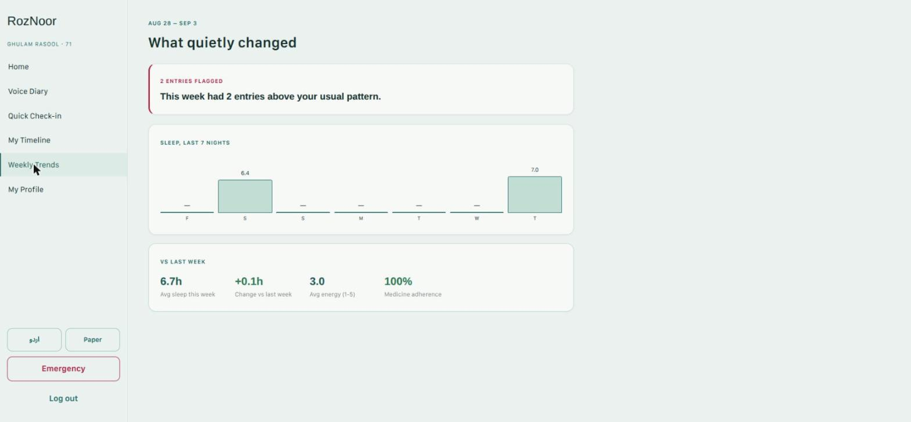

# RozNoor

**Silent symptom & personal baseline monitoring** — a remote patient-monitoring
system for post-discharge heart-failure and post-surgical patients. Patients
log a daily check-in (voice or quick-tap); a deterministic rule engine —
optionally sharpened by an AI interpretation layer and an acoustic-signal
pass — turns each entry into a **Green / Yellow / Orange / Red** risk result.
Anything non-Green surfaces to the patient's doctor as an alert, with a full
roster/timeline/notes view for clinicians and a lightweight people-and-roles
screen for admins.

Built for a hackathon submission. Feature-complete across all three roles
(patient, doctor, admin) on **both** a React web app and a Flutter mobile app,
sharing one FastAPI backend.

## Live demo

| | |
|---|---|
| **Web app** | https://roznoor.up.railway.app |
| **Backend API** | https://roznoor-production.up.railway.app (`/docs` for the OpenAPI/Swagger UI, `/health` for a status check) |
| **Android APK** | [`Mobile App APK file/RozNoor.apk`](Mobile%20App%20APK%20file/RozNoor.apk) |

**Login for judges**: any seeded account's login identifier + the shared
password `RozNoor@123`. Full list of every seeded patient/doctor/admin/
attendant account, with role and what each one demonstrates, is in
[`context/seeded-accounts.md`](context/seeded-accounts.md). Quick picks:

| Role | Login identifier | Password | Shows |
|---|---|---|---|
| Patient | `ghulam.rasool@roznoor.care` | `RozNoor@123` | 🔴 Red — chest-pain hard flag |
| Doctor | `a.farooq@civilhosp.pk` | `RozNoor@123` | Roster (4 patients), alerts, patient detail + trend charts |
| Admin | `s.kamran@civilhosp.pk` | `RozNoor@123` | People & roles management |

## Screenshots

| Patient | Doctor | Admin |
|---|---|---|
|  |  |  |
|  |  | |
|  |  | |
|  | | |
|  | | |

More screens are in [`screenshots/`](screenshots/).

## How it works

1. **Patient check-in** (Voice Diary or Quick Check-in) hits `POST /entries`.
2. A **rule engine** (`Backend/app/services/rules.py`) evaluates the entry
   against diagnosis-specific hard red-flags (e.g. chest pain, a rapid weight
   gain — "+2kg in 3 days") and a weighted score built from symptoms, baseline
   deviation, and medication adherence. This layer has **no AI dependency and
   always runs** — it's the safety-net layer, never bypassed.
3. For **voice entries**, Claude (`app/services/ai.py`) first extracts which of
   the diagnosis's checklist symptoms the transcript describes — in English
   or Roman Urdu. Those matches are folded into the **same** symptom set the
   rule engine scores, including hard red-flags (a spoken "chest pain," with
   no manual checkbox, still triggers Red). AI only ever supplies *evidence*
   into the deterministic engine — it never assigns risk on its own, and every
   numeric baseline comparison is computed in plain Python, never phrased by
   the model.
4. An optional **acoustic-signal pass** (`app/services/audio_analysis.py`,
   pure numpy + an `ffmpeg` subprocess — explicitly **not** a machine-learning
   model, no training data exists for this project) can attach a
   pause-ratio / vocal-energy pattern from an uploaded recording as one more
   additive, capped signal — it can never single-handedly push a result to Red.
5. Non-Green results create an **alert**, visible on the patient's assigned
   doctor's roster and alerts panel, with full check-in history, trend charts,
   and clinician notes per patient.
6. An **admin** role manages accounts (patients, doctors, attendants, other
   admins) through a "People & roles" screen.

Every threshold in the rule engine and the acoustic layer that isn't sourced
directly from the project's own clinical documentation is explicitly flagged
in the code and in [`context/decisions-log.md`](context/decisions-log.md) as a
proposal needing clinician review — nothing here is presented as clinically
validated.

## Tech stack

- **Backend**: FastAPI (Python), SQLAlchemy 2.0 + Alembic, PostgreSQL, JWT auth
  (PyJWT + bcrypt), Claude API (`claude-opus-5`) for symptom extraction and
  summaries, numpy + `ffmpeg` for acoustic feature extraction.
- **Web app**: React + Vite (JavaScript), React Router, plain CSS custom
  properties for the Paper/Nocturne theme — no UI framework, no Redux/Zustand.
- **Mobile app**: Flutter (Dart), Provider for state management,
  `flutter_secure_storage` for the JWT, `speech_to_text` + `record` for Voice
  Diary.
- **Deployment**: Railway — the backend and web app as two Dockerized
  services sharing one Postgres instance and a persistent Volume for uploaded
  audio; the mobile app is a directly-installable release APK (not deployed
  to Railway).

## Repository layout

```
Backend/              FastAPI backend — auth, rules engine, AI layer,
                       acoustic analysis, doctor/admin routers, Alembic
                       migrations, seed data, Dockerfile
web_app/               React + Vite web app — patient, doctor, and admin
                       roles, Dockerfile + nginx for production
mobile_app/            Flutter app — patient/attendant, doctor, and admin
                       roles
Mobile App APK file/   Prebuilt release APK, ready to install
screenshots/           Screenshots of all three roles on the live web app
docs/                  Original project/design documents (schema plan,
                       final project doc, mobile UI field requirements,
                       pitch deck content plan)
UI Inspo/              Design prototype (RozNoor.dc.html) used as the
                       visual/content source for every screen
context/               Living project memory — schema, API contracts,
                       conventions, decisions log, and progress tracking,
                       updated as work happens (see below)
```

## Getting started (local development)

### Backend

Requires Python 3.11+, PostgreSQL, and `ffmpeg` on `PATH` (used to decode
uploaded Voice Diary recordings).

```bash
cd Backend
python3 -m venv .venv && source .venv/bin/activate
pip install -r requirements.txt

cp .env.example .env
# edit .env: DATABASE_URL, JWT_SECRET_KEY, and (optional) ANTHROPIC_API_KEY
# — the app runs fully on its rule-only fallback with no API key configured;
# voice-transcript symptom extraction ("source": "merged") needs a real key.

alembic upgrade head
python seed.py        # safe to re-run locally — clears and re-seeds demo data;
                       # NEVER re-run against the live production database
                       # (see context/pre-deployment-checklist.md, Step 4)

uvicorn app.main:app --host 0.0.0.0 --port 8000 --reload
```

`--host 0.0.0.0` is required for a phone or another device on the same
network to reach it — see `context/conventions.md` for the full real-device
setup (LAN IP, Android cleartext-traffic config for a TLS-less dev backend).

### Web app

```bash
cd web_app
npm install
npm run dev   # http://localhost:5173 — dev-server proxy forwards API calls
              # to http://localhost:8000, no CORS setup needed locally
```

### Mobile app

Requires Flutter (stable channel).

```bash
cd mobile_app
flutter pub get
flutter run -d <device-id> --dart-define=ROZNOOR_API_BASE_URL=http://<backend-host>:8000
```

Find your dev machine's LAN IP with `hostname -I` when testing on a real
device over WiFi; an Android emulator instead uses `10.0.2.2` for the host's
`localhost`. Or just install the prebuilt
[`Mobile App APK file/RozNoor.apk`](Mobile%20App%20APK%20file/RozNoor.apk),
already built against the live production backend.

## Project status

Feature-complete: all three roles (patient, doctor, admin) are built and
verified on both platforms, the backend is deployed and seeded on Railway,
and every real-device/real-connectivity gap the team could test (voice
recognition + acoustic capture on a real phone and in a real browser, the
doctor role on real hardware) has been closed out. See
[`context/progress.md`](context/progress.md) for the full history and
[`context/pre-deployment-checklist.md`](context/pre-deployment-checklist.md)
for exactly what's hardened for deployment vs. what remains a deliberate,
documented hackathon-scope shortcut (e.g. no refresh tokens, a shared demo
password, unreviewed clinical thresholds).

## Documentation

This project keeps a living "project memory" in `context/`, updated as work
happens rather than only at the end of a session:

- [`context/schema.md`](context/schema.md) — database schema as implemented
- [`context/api-contracts.md`](context/api-contracts.md) — every endpoint's
  request/response shape
- [`context/conventions.md`](context/conventions.md) — folder structure,
  coding conventions, RBAC patterns, frontend architecture (both platforms)
- [`context/decisions-log.md`](context/decisions-log.md) — every design
  decision and its rationale, newest first
- [`context/progress.md`](context/progress.md) — what's built, what's
  verified, what's still open
- [`context/pre-deployment-checklist.md`](context/pre-deployment-checklist.md) —
  the Railway deploy runbook and every hardening item, fixed or deliberately
  deferred
- [`context/pending-device-tests.md`](context/pending-device-tests.md) —
  real-hardware verification checklist and status
- [`context/seeded-accounts.md`](context/seeded-accounts.md) — every demo
  login, pulled directly from `seed.py`

## License

MIT — see [LICENSE](LICENSE).
